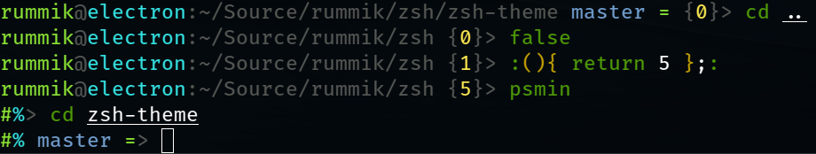

My ZSH theme

Supports [psmin][], git status prompt, and nix-shell

[psmin]: https://gitlab.com/zick.kim/zsh/zsh-psmin

Screenshot:

Installable with:

- [Zplug](https://github.com/zplug/zplug): `zplug "rummik/zsh-theme", as:theme`
- [Antigen](https://github.com/zsh-users/antigen): `antigen theme rummik/zsh-theme`
